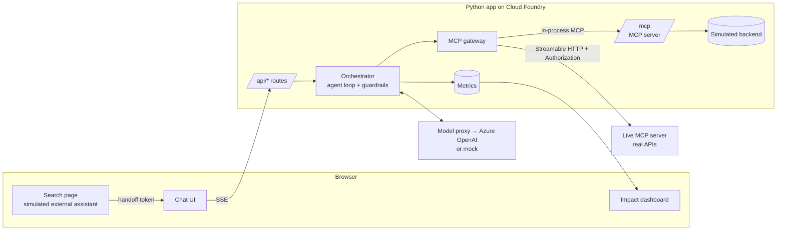

# Architecture

## Components

## A chat turn

1. **Handoff.** The search page calls `POST /api/handoff` with the search text. The app matches it to a scenario (keywords in the YAML) and returns a signed JWT that expires in 5 minutes and works once. It holds only the scenario id and the search phrase.
2. **Session.** The chat page redeems it with `POST /api/sessions`. The app clones the scenario's simulated customer (so parallel demos don't interfere), builds the system prompt with the search context, and removes the token from the address bar.
3. **Kickoff.** The UI immediately sends `{"kickoff": true}`. The assistant greets the customer by name and starts diagnosing without asking them to repeat anything.
4. **Agent loop** (`app/orchestrator.py`), up to `MAX_TOOL_ROUNDS` rounds:
   - Stream the model's text to the browser.
   - For each tool call: check the allowlist, clean arguments, inject `customer_id`.
     - **Read tools** (`readOnlyHint=true`) run in parallel through the MCP gateway; results stream as cards.
     - **Action tools** become a pending action and a confirm card. Nothing executes yet.
   - Feed results back to the model; repeat until it answers without tool calls.
   - Check every dollar amount in the reply against tool results.
5. **Order preview.** For purchases, the model calls `preview_order` (a read tool) and summarizes the quote; `submit_upgrade_order` is refused until that offer was previewed.
6. **Confirmation.** Tapping Confirm sends `{"confirmation": {"action_id", "approved"}}`. Only then does the server execute the action, then the model narrates the result.

## Server-sent events

`POST /api/sessions/{id}/turn` returns `text/event-stream`. Event types:

| Event | Meaning |
|---|---|
| `turn_start` / `done` | Turn boundaries (`done` lists pending action ids) |
| `text` / `segment_end` | Streaming text; `segment_end` carries the final, guardrail-checked text |
| `tool_start` / `tool_result` | A tool call and its result, with `source` (sim/live), `fallback`, `latency_ms` |
| `confirm_required` / `action_resolved` | Human-in-the-loop actions |
| `guardrail` | A server-side check changed the output |
| `notice` / `error` | Informational / failure message safe to show |

## Data-source routing

One rule for every tool: with `LIVE_MCP_URL` set, calls go to the live server first; otherwise to our in-process simulator. The live path falls back to the simulator when the live server doesn't list the tool, can't be reached, or returns an error; the UI badges those cards **sim (fallback)** with the reason, so the demo never silently fakes live data. Live calls carry `Authorization: Bearer <LIVE_MCP_TOKEN>` and the scenario's `live_customer_id` when set.

## Why the model never sees `customer_id`

Tool schemas sent to the model have `customer_id` removed (`ToolSpec.llm_schema`). The orchestrator adds it from the session on every call. A prompt-injected model can't target another account because it has no parameter to put one in, and any value it invents is overwritten.

## The MCP server is the contract

`app/mcp_server.py` defines the tools once. The orchestrator discovers them by listing tools from that server at startup, so the tool descriptions, argument schemas and read/action classification all come from one place. The same server is exposed at `/mcp` for any external MCP client.

The MCP endpoint runs **stateless with JSON responses**, so any app instance can answer any request behind the Cloud Foundry router (no sticky sessions).

## Swapping pieces

| To change | Edit |
|---|---|
| Model endpoint | `.env` only (`LLM_PROXY_URL`, `LLM_PROXY_KEY`) |
| Scenario behaviour | `scenarios/*.yaml` |
| Prices, plans, promo, mobile bundle, devices, trade-in | `data/catalog.yaml` |
| A tool's contract | `app/mcp_server.py` (+ `app/sim.py` for simulated behaviour) |
| Business rules (e.g. upsell threshold) | `app/sim.py` (in production, these live in the real APIs) |
